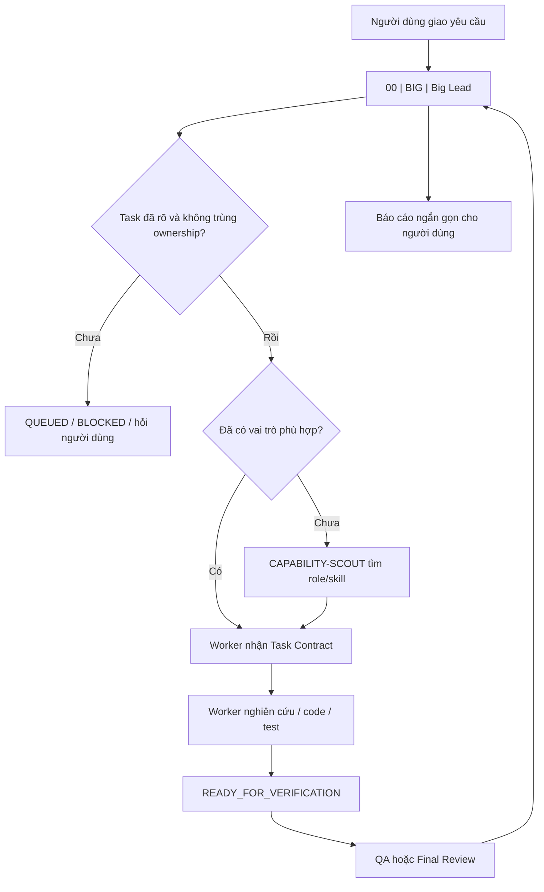

<div align="center">

# ⚡ Orca Codex Team Lead

### Bộ quy trình điều phối agent cho Codex chạy bên trong Orca

Một Big Lead giữ hướng đi. Worker làm việc thật. Mỗi người một phần rõ ràng.

<p>
  
  
  
</p>

<p>
  <strong>Chia việc đúng người · Làm song song có kiểm soát · Báo cáo dễ hiểu</strong>
</p>

</div>

> Đây là quy trình dành cho **Codex chạy trong Orca**. Orca phải đang chạy để tạo terminal, theo dõi worker, đổi tên terminal, gửi thông báo và khôi phục sau khi có lỗi.

## 🌟 Vì sao nên dùng

Khi dự án có nhiều việc cùng lúc, vấn đề thường không phải thiếu agent mà là:

- Không biết agent nào đang làm việc gì.
- Hai agent sửa trùng một vùng code.
- Lead tự làm hết nên không còn điều phối.
- Terminal bị lỗi nhưng task vẫn bị xem là đang chạy.
- Có kết quả nhưng không có bằng chứng để biết đã thật sự xong chưa.

Quy trình này giải quyết bằng một nguyên tắc đơn giản:

```text
Big Lead giữ bản đồ và quyết định
        ↓
Lead phụ chỉ xuất hiện khi một mảng đủ lớn
        ↓
Worker nghiên cứu, code, test và tạo bằng chứng
        ↓
Kiểm tra lần đầu rồi mới kết luận xong
        ↓
Big Lead báo kết quả ngắn gọn cho người dùng
```

## 🚀 Bắt đầu nhanh

### 1. Cài quy trình vào Orca

Copy thư mục `skills/lead` vào thư mục skill của Orca:

```text
%USERPROFILE%\.agents\skills\lead
```

Sau đó khởi động lại Orca hoặc mở một terminal Codex mới.

### 2. Khởi tạo trong dự án

Trong terminal Codex của Orca, gõ `$`, chọn **Orca Codex Team Lead**, rồi gửi:

```text
Khởi tạo team cho dự án này.
```

Hoặc gửi trực tiếp:

```text
$lead init
```

Lần đầu khởi tạo sẽ tạo thư mục `.orca-team/` và kiểm tra một Big Lead duy nhất cho dự án.

> Không dùng `/lead`. Dấu `/` là lệnh có sẵn của Codex Terminal; `$lead` là skill điều phối của Orca.

### 3. Giao việc

```text
$lead Thêm API suspend/restore cho job và viết smoke test.
```

Big Lead sẽ ghi task, kiểm tra vùng code, chọn worker phù hợp và chỉ mở worker khi Orca trả về terminal thật.

Lần khởi tạo cũng tạo sẵn ba file dễ chỉnh trong `.orca-team/`:

- `MODEL_POLICY.md`: chọn model và model dự phòng cho riêng dự án.
- `PROJECT_HOOKS.md`: checklist theo từng thời điểm để team không quên bước quan trọng.
- `TEAM_POLICY.md` / `TEAM_RULES.md`: ranh giới an toàn và rule chung của dự án.

Model mới không được dùng ngay chỉ vì đã ghi vào file. Orca phải kiểm tra trước, rồi Big Lead mới phân công.

## 🧭 Nhìn toàn bộ quy trình



## 👥 Ai làm việc gì?

| Vai trò | Trách nhiệm | Không làm |
|---|---|---|
| **Big Lead** | Nhận yêu cầu, chia việc, xếp ưu tiên, giữ state, kiểm tra bằng chứng, báo người dùng | Không tự code, debug, test hay nghiên cứu thay worker |
| **Lead phụ** | Điều phối một mảng lớn như `AUTH`, `ADMIN`, `JOBS` | Không sở hữu toàn bộ dự án, policy hoặc Git |
| **Worker** | Nghiên cứu, sửa code, viết test, cập nhật tài liệu và báo kết quả | Không tự đổi scope, tự dùng quyền ngoài task |
| **QA / Final Review** | Kiểm tra acceptance, regression, contract và bằng chứng cuối | Không tự sửa phần của worker khác nếu chưa được giao |
| **Capability Scout** | Tìm vai trò Agency/skill phù hợp khi team đang thiếu năng lực | Không tự cài tool hoặc biến role thành Lead mới |
| **Research Worker** | Tìm và tổng hợp nguồn cần thiết cho quyết định | Không đưa dữ liệu riêng ra ngoài |

### Quy tắc quan trọng

**Lead điều phối, worker làm việc thật.** Nếu một task có nghiên cứu, code, test, debug hoặc sửa file mà không có worker terminal hiển thị, dùng:

```text
$lead audit
```

Lead phải để task chờ kiểm tra, không tự làm thay chỉ để báo nhanh hơn.

## 🖥️ Nhận diện terminal

Tên terminal luôn bắt đầu bằng số để nhìn ra quan hệ:

```text
00 | BIG          | MEU-HIRE-FE     | RUN
10 | LEAD-ADMIN   | T-100           | RUN
11 | WORKER-API   | T-101.1         | RUN
12 | WORKER-UI    | T-101.2         | RUN
19 | QA-ADMIN     | T-101.QA        | CHECK
90 | VIEW         | MEU-HIRE-FE     | VIEWER_ONLY
```

- `00`: Big Lead duy nhất của dự án.
- `10–19`: một nhánh Lead phụ và các worker của nhánh đó.
- `20–29`: nhánh tiếp theo.
- `90`: terminal xem trạng thái, không được tự mở worker.

Mở terminal thứ hai trong cùng dự án **không** tạo Big Lead thứ hai. Terminal đó là viewer cho đến khi recovery/takeover được xác minh.

Sau khi mở worker, Lead phải đổi tên tab bằng handle Orca trả về và kiểm tra lại tab đã đổi. Nếu vẫn thấy `worker-task_<id>`, đó là dấu hiệu cổng đổi tên chưa chạy hoặc dùng handle cũ; worker chưa được ghi là `RUN` hoàn chỉnh trên bảng team.

Lead cũng phải kiểm tra worker đã bắt đầu thật. Nếu Orca mới báo đã nhận nội dung nhưng worker chưa chạy, Lead sẽ lấy handle mới và gửi Enter một lần; sau đó kiểm tra lại trạng thái. Bạn không cần tự nhấn Enter. Nếu vẫn không chạy, việc đó được báo là đang bị chặn thay vì ghi nhận sai là worker đang làm.

## 🧠 Agency Agents: chọn đúng chuyên môn

Agency Agents được dùng như **thư viện vai trò chuyên môn**, không phải hệ thống điều phối thứ hai.

Khi chạy `$lead init`, nếu còn slot, Big Lead giao một worker chỉ-đọc lập danh sách vai trò phù hợp với dự án trong:

```text
.orca-team/AGENCY_PROFILE_REGISTRY.md
```

Ví dụ:

| Loại dự án | Vai trò thường phù hợp |
|---|---|
| API / Backend | Backend Architect, API Tester, Database Optimizer, Identity & Access Engineer |
| Frontend / Web | Frontend Developer, UI Designer, Accessibility Auditor, Test Automation Engineer |
| Auth / dữ liệu nhạy cảm | Application Security Engineer, Privacy Engineer, Code Reviewer |
| Công nghệ hoặc kiến trúc mới | Research Synthesist trước, rồi worker triển khai |

Khi gặp yêu cầu mới:

```text
Role đã duyệt trong dự án
        ↓ chưa có
CAPABILITY-SCOUT tìm profile phù hợp trong Agency
        ↓ vẫn chưa đủ
Research Worker tìm tài liệu công khai
        ↓
Worker triển khai nhận card role ngắn
```

Role Agency không tự:

- tạo Lead hoặc terminal;
- đổi model;
- cấp quyền Git, database, deploy hoặc service;
- tự cài bundle agent;
- thay đổi scope mà người dùng đã giao.

## 🌐 Agent-Reach: tìm nguồn công khai có kiểm soát

Agent-Reach chỉ dành cho **Research Worker** khi tài liệu nội bộ, tài liệu chính thức và standard chưa đủ.

Được phép mặc định:

- đọc website công khai, RSS, YouTube công khai, GitHub công khai;
- tìm ví dụ và thảo luận công khai để hỗ trợ quyết định;
- ghi nguồn, kết luận và giới hạn evidence vào `.orca-team/RESEARCH_NOTES/`.

Không được phép mặc định:

- tự cài Agent-Reach hoặc dependency mới;
- dùng cookie, token, tài khoản đăng nhập, Chrome profile hoặc proxy;
- gửi source nội bộ, URL private, log chưa lọc, thông tin khách hàng hoặc dữ liệu production;
- đăng bài, nhắn tin, like, tạo issue/PR hoặc thao tác ghi bên ngoài.

Nếu cần cài tool, dùng login/cookie hoặc gửi dữ liệu ra dịch vụ ngoài, task chuyển sang `WAITING_USER` để hỏi bạn trước.

## 📋 Các lệnh thường dùng

| Lệnh | Dùng khi |
|---|---|
| `$lead` | Khôi phục state và xem việc đang làm |
| `$lead init` | Khởi tạo team lần đầu trong dự án |
| `$lead status` | Chỉ xem trạng thái, không mở worker |
| `$lead audit` | Kiểm tra Lead có ôm việc hoặc task có thiếu worker không |
| `$lead roles` | Xem vai trò Agency đang có/chờ duyệt/đang dùng |
| `$lead capability <nhu cầu>` | Tìm năng lực hoặc role còn thiếu |
| `$lead research <chủ đề>` | Tạo nghiên cứu có phạm vi rõ |
| `$lead preview <chủ đề>` | Xin người dùng chốt hướng UI/UX hoặc flow lớn |
| `$lead models` | Xem model nào đã sẵn sàng dùng, model nào cần kiểm tra |
| `$lead models validate` | Kiểm tra model trong cấu hình trước khi phân việc |
| `$lead models set ...` | Ghi lựa chọn model mới của bạn cho dự án, rồi chờ Orca kiểm tra |
| `$lead policy` | Xem ranh giới an toàn đang áp dụng |
| `$lead hooks` | Xem checklist theo từng thời điểm đang áp dụng |
| `$lead hook add ...` | Thêm checklist mới theo yêu cầu rõ ràng của bạn |
| `$lead config check` | Kiểm tra nhanh cấu hình team, model và hook |
| Yêu cầu `$lead report today` | Tổng hợp hôm nay đã làm gì, đang vướng gì và bước tiếp theo |
| `$lead recover` | Khôi phục sau khi Orca restart |
| `$lead take over` | Thay Big Lead cũ khi đã xác minh lỗi/dừng hoặc có xác nhận của người dùng |
| `$lead rules` | Xem rule đang áp dụng |

## 📝 Báo cáo cuối ngày

Khi bạn hỏi “hôm nay team đã làm gì?”, **Big Lead** sẽ tổng hợp từ state và báo cáo của worker:

1. Đã hoàn thành.
2. Đang thực hiện.
3. Bị chặn.
4. Đã kiểm tra.
5. Việc tiếp theo.

Ví dụ:

```text
Hôm nay team đã:

- Hoàn thành API suspend/restore job.
- Thêm kiểm tra Idempotency-Key.
- Chạy smoke test cho các trạng thái chính.
- Đang chờ cấp permission mới từ backend.

Việc tiếp theo: lấy JWT mới và chạy smoke test end-to-end.
```

Nếu cần tạo báo cáo thành file, Big Lead có thể giao `Technical Writer`, `Meeting Notes Specialist` hoặc `Executive Summary Generator`. Các role này chỉ viết từ bằng chứng đã có, không tự đoán kết quả.

## 🔁 Khi có nhiều yêu cầu cùng lúc

Yêu cầu mới không tự hủy việc đang làm:

```text
Yêu cầu 1 đang chạy
        + Yêu cầu 2 đến
        + Yêu cầu 3 đến
                ↓
Big Lead ghi cả 3 vào task board
                ↓
Task độc lập → READY / chạy song song
Task cần việc khác → QUEUED hoặc BLOCKED
Task cần bạn chọn → WAITING_USER
```

Mặc định một Big Lead có tối đa ba worker triển khai. Chỉ tạo Lead phụ khi có ít nhất hai nhánh độc lập, đủ việc dài hạn và Orca còn capacity. Khi hết việc, Lead phụ và worker được thu gọn.

## 🧪 Cổng chất lượng: lần làm đầu chưa phải kết quả cuối

Một worker nói “xong” chưa đủ để task được đóng. Sau lần làm đầu, task đi qua hai bước rõ ràng:

```text
Worker làm xong phần việc
        ↓
READY_FOR_VERIFICATION — nộp bằng chứng đã kiểm tra và phần chưa kiểm tra
        ↓
VERIFYING — Big Lead hoặc QA đối chiếu bằng chứng
        ↓
DONE — chỉ khi mức kiểm tra phù hợp đã đạt
```

Việc nhỏ không bị bắt kiểm tra vòng vo: worker evidence và Big Lead đối chiếu là đủ. Việc có rủi ro cao như quyền truy cập, thanh toán, cập nhật database, API công khai hoặc kết nối BE–FE cần QA riêng hoặc kiểm tra nhanh tách riêng.

Big Lead phải kiểm tra checklist phù hợp:

- **API/backend:** request, response, status/error, permission, state, idempotency và test.
- **UI/UX:** desktop/mobile, loading, empty, error, accessibility và visual check.
- **Database/state:** migration, null/legacy data, rollback và compatibility.
- **Tích hợp BE/FE:** contract, field nullable, permission, error mapping và smoke test.
- **Research/review:** nguồn, kết luận, đánh đổi, giới hạn và quyết định.

Với màn hình mới, redesign lớn hoặc đổi flow, Big Lead gửi preview để bạn chốt hướng trước khi worker làm phần quyết định.

## 🤖 Model theo từng dự án

Bạn không bị khóa vào một bộ model. Sau `$lead init`, chỉ cần mở `.orca-team/MODEL_POLICY.md` để chọn model, mức suy nghĩ và thứ tự dự phòng theo ý dự án.

Mẫu ban đầu vẫn có sẵn để dùng nhanh:

| Vai trò / việc | Model chính | Dự phòng |
|---|---|---|
| Big Lead / Lead phụ | `gpt-5.6-terra` · `xhigh` | `qwen3.8-max-0902` |
| Worker việc khó | `qwen3.8-max-0902` · `high` | DeepSeek → GLM |
| Worker việc thường | `deepseek-v4.1-flash` · `medium` | Qwen → GLM |
| Worker việc nhỏ | `glm-5.3-flash` · `low` | DeepSeek → Qwen |
| Kiểm tra cuối | `qwen3.8-max-0902` · `high` | DeepSeek → GLM |

Điểm quan trọng: Big Lead chỉ giao việc bằng model có trạng thái `verified` trong `MODEL_STATUS.md`. Khi bạn đổi policy, dùng `$lead models validate`; mỗi model chỉ kiểm tra một lần cho mỗi lần chỉnh policy, không làm tốn slot lặp lại.

Nếu worker lỗi model, Big Lead giữ nguyên vùng code và checkpoint, rồi retry **cùng task bằng chính model đó đủ 3 lần** (lần đầu, lần 2, lần 3). Chỉ khi cả 3 lần đều có lỗi model đã xác nhận mới xoay sang model tiếp theo trong pool của worker. Pool Qwen, DeepSeek và GLM trong file setup chỉ là mẫu mặc định; nếu bạn sửa pool trong `.orca-team/MODEL_POLICY.md`, Lead sẽ dùng đúng các model trong file đó. Nếu hết model trong pool đã cấu hình, task dừng ở `WAITING_USER` để bạn chọn.

## 🪝 Rule và hook dễ chỉnh

Bạn chỉnh giới hạn an toàn trong `TEAM_POLICY.md`, rule chung trong `TEAM_RULES.md`, còn `PROJECT_HOOKS.md` là checklist nhắc team làm đúng thời điểm:

- `before_worker_launch`: có contract, vùng code riêng, model đã kiểm tra và còn chỗ trống.
- `before_external_action`: có quyền riêng trước Git, database, deploy hoặc thay đổi bên ngoài.
- `before_done`: đi qua First-Pass Gate và đủ bằng chứng.
- `on_model_failure`: giữ checkpoint, rồi mới dùng model dự phòng được phép.

Hook không phải chương trình tự chạy. Nó không được phép âm thầm chạy lệnh, chạm Git/database/deploy, đăng nhập, lấy token, tạo hàng loạt worker hoặc đổi quyền của bạn.

## 🗂️ Những gì được tạo trong mỗi dự án

```text
.orca-team/
├── TEAM_POLICY.md                  # Ranh giới và chính sách team
├── TEAM_RULES.md                   # Rule do người dùng/Root Lead đặt
├── PROJECT_HOOKS.md                # Checklist theo từng thời điểm, không tự chạy lệnh
├── MODEL_POLICY.md                 # Model/effort/fallback do dự án chọn
├── MODEL_STATUS.md                 # Kết quả Orca kiểm tra model thật
├── TEAM_STATE.md                   # Mục tiêu, task, owner, dependency
├── LEAD_LEASE.md                   # Big Lead duy nhất
├── TEAM_DASHBOARD.md               # Bảng nhìn nhanh toàn team
├── AGENCY_PROFILE_REGISTRY.md      # Vai trò Agency theo dự án
├── SKILL_REGISTRY.md               # Skill chờ duyệt/đã duyệt/đang dùng
├── EXTERNAL_RESEARCH_POLICY.md     # Luật Agent-Reach và nguồn ngoài
├── QUALITY_GATES.md                # Checklist và First-Pass Gate trước khi báo xong
└── RESEARCH_NOTES/                 # Brief nghiên cứu dùng lại được
```

State trong `.orca-team` là sổ điều phối, không thay thế inventory Orca live. Sau khi Orca restart, phải dùng `$lead recover` để kiểm tra terminal thật trước khi giao lại việc.

## 🔐 Ranh giới an toàn

- Không tự chạy Git nếu người dùng chưa duyệt theo policy dự án.
- Không tự chạy migration database dùng chung.
- Không tự đổi DB target, restart service, deploy hoặc đổi permission remote.
- Không gửi credential, token, private URL, log nhạy cảm hay dữ liệu khách hàng qua tin nhắn team.
- Không coi dashboard cũ là bằng chứng worker còn sống sau khi Orca restart.
- Không tự coi lần làm đầu là đúng; chỉ báo `Đã xong` sau khi đã kiểm tra đúng mức.
- Không dùng model mới chỉ vì được ghi trong cấu hình; Orca phải xác nhận trước.
- Hook chỉ là checklist, không phải đường để tự chạy lệnh hay vượt quyền của bạn.
- Agent nói với người dùng phải nói tiếng Việt ngắn gọn, kết quả trước, không đẩy log nội bộ.

## 🛠️ Cấu trúc repository

```text
skills/lead/
├── SKILL.md
├── agents/openai.yaml
├── references/
│   ├── agency-profiles-and-agent-reach.md
│   ├── capability-discovery-and-skill-gate.md
│   ├── model-policy-and-validation.md
│   ├── project-rules-and-hooks.md
│   ├── first-pass-verification.md
│   ├── research-first-gate.md
│   ├── task-contract-template.md
│   └── ...
└── scripts/
    ├── bootstrap-project.ps1
    └── test-team-config.ps1
```

## 📚 Nguồn tham khảo

- [Agency Agents](https://github.com/msitarzewski/agency-agents) — thư viện vai trò chuyên môn.
- [Agent-Reach](https://github.com/Panniantong/Agent-Reach) — công cụ tìm nguồn công khai, chỉ dùng theo policy.
- [Codex Skills](https://developers.openai.com/codex/skills/) — cấu trúc và cách Codex sử dụng skill.

## 📄 Giấy phép

MIT. Xem [LICENSE](LICENSE).

<div align="center">

### Làm đúng người · Đúng việc · Đúng bằng chứng

</div>
