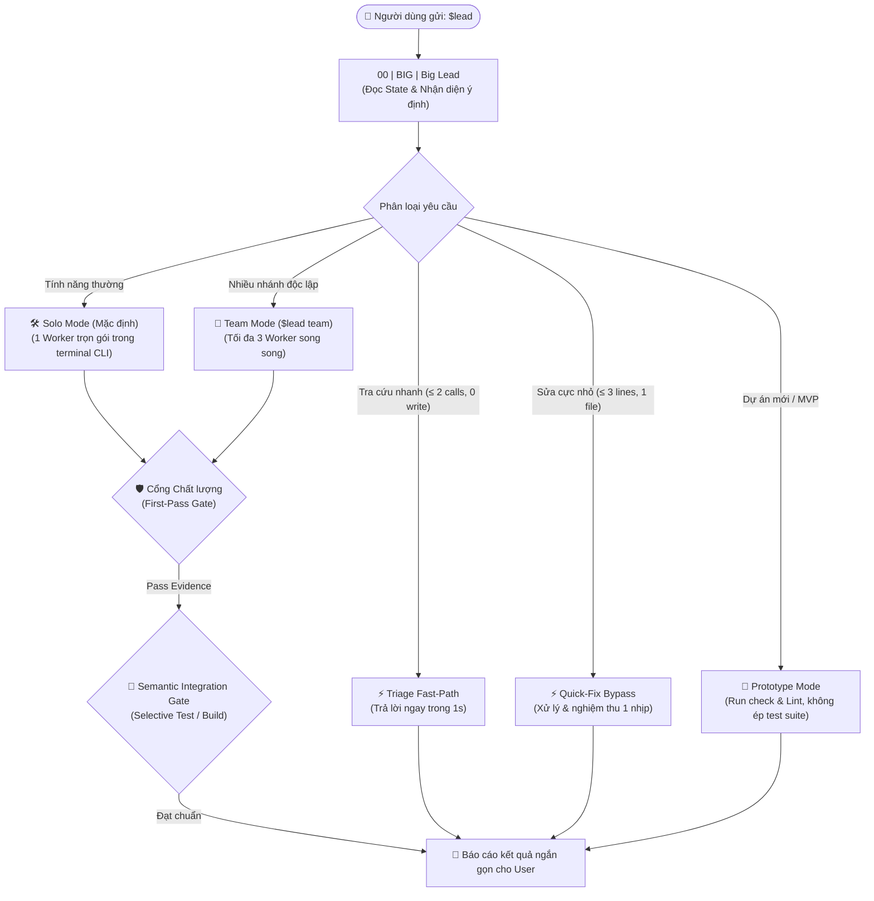

<div align="center">

# ⚡ Orca Codex Team Lead

### Hệ thống Điều phối Đội ngũ Kỹ sư AI Tự chủ (Autonomous Engineering Team) cho Codex bên trong Orca

*From a single typo to enterprise monorepos — orchestrated with zero ceremony, verifiable evidence, and strict safety.*

<p align="center">
  <a href="https://github.com/TINVO04/codex-agent-team-lead"></a>
  <a href="https://github.com/TINVO04/codex-agent-team-lead"></a>
  <a href="https://github.com/TINVO04/codex-agent-team-lead"></a>
  <a href="https://github.com/TINVO04/codex-agent-team-lead/blob/main/LICENSE"></a>
</p>

<p align="center">
  <strong>🎯 Tối giản thủ tục · 🛡️ An toàn đa tầng · ⚡ Thích ứng mọi dự án · 📊 Bằng chứng quan sát được</strong>
</p>

</div>

---

## 🌟 Tại sao cần Orca Codex Team Lead?

Các hệ thống Multi-Agent truyền thống thường gặp phải hai căn bệnh lớn: **"Mất kiểm soát khi đông người"** hoặc **"Rườm rà quá mức" (Coordination Tax & Prompt Bloat)**. 

Quy trình này được sinh ra để khắc phục triệt để điều đó:

| Vấn đề của Multi-Agent truyền thống | Giải pháp của Orca Codex Team Lead |
| :--- | :--- |
| **Hai agent sửa đè code nhau:** Gây xung đột logic và vỡ codebase. | **Vùng sở hữu cô lập (Ownership Zones):** Phân chia biên giới code chặt chẽ, tuần tự hóa các file dùng chung. |
| **Lead tự làm hết hoặc chat lan man:** Lead ôm việc của worker, tốn token mà không ra kết quả. | **Delegation Gate rõ ràng:** Big Lead giữ bản đồ và điều phối; Worker làm việc thật trong terminal CLI hiển thị rõ. |
| **Nghi thức rườm rà & ngốn token:** Sửa 1 typo hay 1 dòng config cũng lập plan 3 bước, gọi LLM QA tốn 20k token. | **Cascade Triage & Token Diet (2026):** Tự động nhận diện 4 cấp độ (Level 0–3), nghiệm thu bằng máy (Exit 0) & nén log terminal. |
| **Mất trí nhớ khi crash hoặc restart:** Terminal tắt là mọi tiến trình và bối cảnh biến mất. | **Durable State trên đĩa:** Toàn bộ trạng thái, checkpoint lưu tại `.orca-team/`; khôi phục tức thì khi Orca restart. |
| **Code xong nhưng không biết chạy được không:** Agent tự nói "xong" nhưng đầy bug tiềm ẩn. | **First-Pass Gate & Verifier:** Phải có bằng chứng (evidence) kiểm thử thực tế mới được chuyển sang trạng thái `DONE`. |

---

## 💬 Trải nghiệm Zero-Friction (Quy tắc 2 Lệnh)

Bạn **không cần ghi nhớ hàng chục câu lệnh CLI phức tạp**. Hệ thống tự động nhận diện ý định (Intent Auto-Routing) từ câu nói tiếng Việt tự nhiên của bạn:

```text
Chỉ 2 lệnh bạn cần dùng mỗi ngày:
  1. $lead <nói tự nhiên>   --> Làm mọi việc (Lead tự hiểu ngữ cảnh và phân luồng)
  2. $lead                  --> Xem bảng điều phối và tiến độ hiện tại
```

### Ví dụ hội thoại thực tế:

* ⚡ **Level 0 · Tra cứu chỉ-đọc (Direct Inquiry):**
  > `$lead Hàm validateToken nằm ở file nào và kiểm tra những trường gì?`
  > *`⚡ [Cascade Triage: Level 0 - Direct Inquiry] Tra cứu chỉ-đọc -> Lead giải đáp ngay trong 1 lượt (0 worker, 0 token lãng phí).*`

* ⚡ **Level 1 · Sửa nhỏ 1 nhịp (Solo Fast-Path):**
  > `$lead Sửa lại tiêu đề trong Header và đổi màu nút CTA thành xanh dương`
  > *`⚡ [Cascade Triage: Level 1 - Solo Fast-Path] Sửa nhỏ cô lập (≤1 file) -> Lead tự sửa trực tiếp 1 nhịp, không mở subagent.*`

* 🛠️ **Level 2 · Tính năng chuẩn (Solo Worker):**
  > `$lead Viết thêm API suspend và restore cho user kèm unit test tương ứng`
  > *`⚡ [Cascade Triage: Level 2 - Solo Mode] Phạm vi chuẩn (2-4 files) -> Xử lý trọn gói, nghiệm thu máy (Exit 0).*`

* 👥 **Level 3 · Hệ thống lớn đa miền (Swarm Team Mode):**
  > `$lead Tái cấu trúc lại luồng xác thực JWT cho cả backend server và frontend client`
  > *`⚡ [Cascade Triage: Level 3 - Swarm Mode] Kiến trúc lớn đa miền -> Phân rã 2 Worker song song có kiểm chứng tích hợp.*`

* 🔄 **Đổi model nhanh:**
  > `$lead Đổi sang dùng model gpt-5 cho các task khó tiếp theo`  
  > *(hoặc gắn inline: `$lead [model: claude-3-7-sonnet] Viết thuật toán tối ưu cache`)*.

* 📈 **Báo cáo tiến độ:**
  > `$lead Hôm nay team đã làm được những gì rồi`  
  > *(Lead tự động quét bằng chứng và xuất báo cáo ngắn gọn).*

---

## 🧭 Bản đồ Kiến trúc Điều phối (Chuẩn 2026)



---

## ⚡ Bộ ba Cơ chế Thích ứng (All-Terrain Engine)

Hệ thống tự động biến hóa để phù hợp với quy mô của từng dự án:

```text
┌─────────────────────────────────────────────────────────────────────────────┐
│ 1. QUICK-FIX BYPASS (Sửa nhanh một nhịp)                                    │
│    • Kích hoạt: Diff ≤ 3 dòng, đúng 1 file, không chạm API/DB/Auth.         │
│    • Lợi ích: Tiết kiệm 70% thời gian & token cho việc sửa typo, config.   │
├─────────────────────────────────────────────────────────────────────────────┤
│ 2. PROTOTYPE MODE (Chế độ MVP / Dự án khởi đầu)                             │
│    • Kích hoạt: Tự phát hiện repo chưa có test runner hoặc qua yêu cầu.     │
│    • Lợi ích: Dựng PoC/MVP thần tốc; cấm worker viết mock test sáo rỗng.    │
├─────────────────────────────────────────────────────────────────────────────┤
│ 3. SELECTIVE TESTING (Kiểm thử chọn lọc cho Monorepo)                       │
│    • Kích hoạt: Monorepo (Nx, Turborepo, pnpm workspaces, Gradle, Cargo).   │
│    • Lợi ích: Chỉ test package bị ảnh hưởng (--filter), không nghẽn build.  │
└─────────────────────────────────────────────────────────────────────────────┘
```

---

## 🤖 Quản lý Model 3 Tầng Linh hoạt (3-Tier System)

Không cần probe kiểm tra rườm rà. Áp dụng **Optimistic Launch**: worker chạy ngay với model được chọn và tự động lưu `verified` khi thành công:

| Tầng năng lực (Tier) | Model tiêu biểu | Effort | Phạm vi công việc |
| :--- | :--- | :--- | :--- |
| **Tier 1: Heavy / Frontier** | `gpt-5.6-terra` / `qwen3.8-max-0902` | `xhigh` | Big Lead, Domain Lead, Kiến trúc sư, Code khó, Bug sâu, Integration |
| **Tier 2: Standard** | `deepseek-v4.1-flash` / `qwen3.8-max-0902` | `medium` | Code tính năng thông thường, viết unit test, research vừa |
| **Tier 3: Eco / Fast** | `glm-5.3-flash` | `low` | Đọc file, format code, sửa tài liệu, tra cứu nhỏ |

---

## 🩺 Lệnh Khám sức khỏe: `$lead doctor`

Chỉ với một lệnh duy nhất, bạn có thể kiểm tra toàn diện sức khỏe của cả đội ngũ:

```bash
$lead doctor
```

```text
═══════════════════ TEAM HEALTH REPORT ═══════════════════
✔ Big Lead Lease    : Active (00 | BIG | MEU-HIRE | RUN)
✔ Model Status      : Tier 1 (Verified) | Tier 2 (Verified) | Tier 3 (Verified)
✔ Delegation Audit  : Pass (0 tasks without workers, 0 orphan terminals)
✔ Git Boundaries    : Strict (Read-only free, Mutating requires user approval)
✔ Quality Gates     : Active (Quick-Fix, Prototype, Selective Testing enabled)
✔ Active Workers    : 1 Worker running (11 | WORKER-API | T-101.1 | RUN)
══════════════════════════════════════════════════════════
```

---

## 🖥️ Quy chuẩn Nhận diện Terminal trong Orca

Tất cả terminal được đánh số và đặt nhãn chuẩn để quan sát trực quan ngay trên thanh tab:

```text
00 | BIG          | MEU-HIRE        | RUN           <-- Big Lead duy nhất
10 | LEAD-ADMIN   | T-100           | RUN           <-- Domain Lead (nếu có)
11 | WORKER-API   | T-101.1         | RUN           <-- Worker phụ trách API
12 | WORKER-UI    | T-101.2         | RUN           <-- Worker phụ trách UI
19 | QA-VERIFIER  | T-101.QA        | CHECK         <-- Verifier độc lập
90 | VIEW         | MEU-HIRE        | VIEWER_ONLY   <-- Terminal xem trạng thái
```

---

## 🚀 Khởi động Nhanh trong 30 Giây

### 1. Cài đặt vào Orca
Sao chép thư mục `skills/lead` vào thư mục skills của máy:
```powershell
# Windows PowerShell
Copy-Item -Recurse skills/lead "$env:USERPROFILE\.agents\skills\lead"
```
*(Nếu đã tạo NTFS Junction sang `.codex\skills\lead`, hai thư mục sẽ tự động đồng bộ).*

### 2. Bắt đầu dùng
Mở terminal Codex bên trong Orca, gõ `$`, chọn **Orca Codex Team Lead**:
```text
$lead init
```
Và sau đó, chỉ cần trò chuyện tự nhiên:
```text
$lead Hãy giúp tôi xây dựng tính năng đăng nhập OAuth với Google.
```

---

## 📁 Cấu trúc Thư mục Điều phối `.orca-team/`

Khi khởi tạo, dự án sẽ có thư mục điều phối độc lập (không commit vào Git nếu muốn giữ riêng tư):

```text
.orca-team/
├── LEAD_LEASE.md             # Khóa bảo vệ Big Lead duy nhất
├── TEAM_STATE.md             # Bảng trạng thái canonical & tiến độ từng task
├── TEAM_DASHBOARD.md         # Bảng tóm tắt trực quan cho người đọc
├── TEAM_POLICY.md            # Hiến pháp ranh giới an toàn & chính sách Git
├── QUALITY_GATES.md          # Bộ tiêu chuẩn nghiệm thu & test ladders
├── MODEL_POLICY.md           # Cấu hình 3 tầng model & pool xoay vòng
├── MODEL_STATUS.md           # Trạng thái runtime quan sát được của các model
├── PROJECT_HOOKS.md          # Checklist các điểm kiểm tra trước/sau launch
├── SKILL_REGISTRY.md         # Sổ đăng ký skill chuyên môn (Lazy-loaded)
└── AGENCY_PROFILE_REGISTRY.md# Thư viện vai trò chuyên gia (Agency Agents)
```

---

<div align="center">
  <sub>Xây dựng với niềm đam mê dành cho cộng đồng Kỹ sư AI · Chuẩn hóa theo thực nghiệm SWE-bench 2026</sub>
</div>
